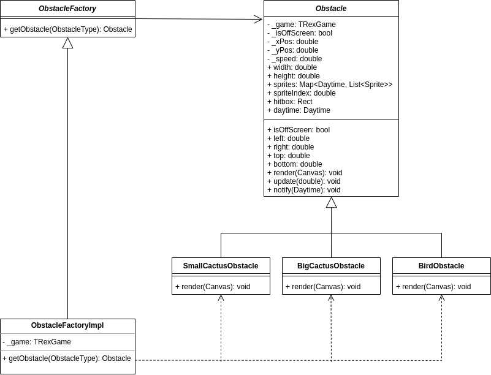
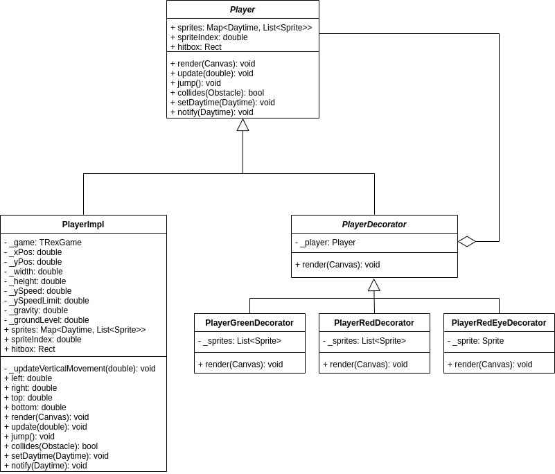
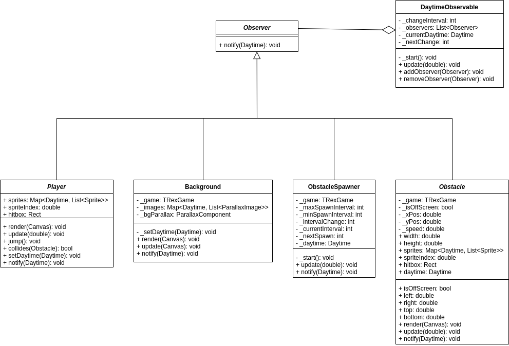
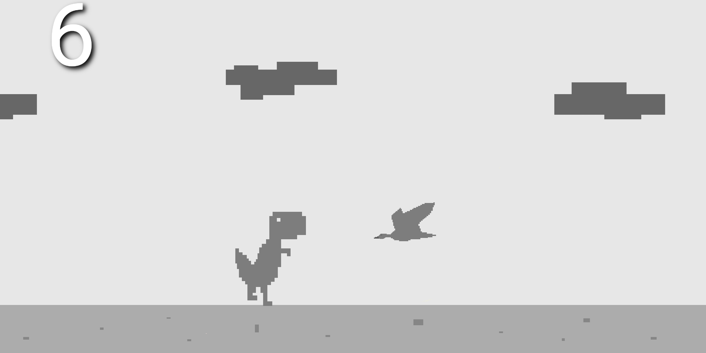
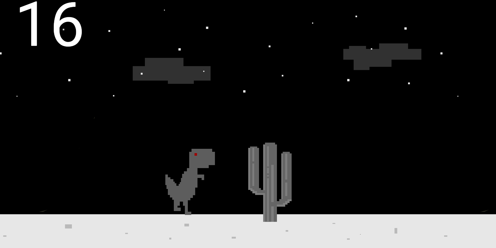
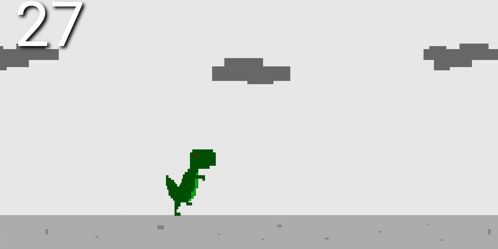
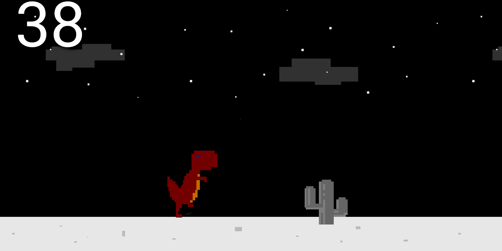

# t_rex

A T-Rex game replica created with flutter for a university course about design patterns.

The main goal of the project was to include at least one design pattern from each of the 3 types.

## Used design patterns

### Factory

The Factory pattern is used for the creation of obstacles.

### Decorator

The Decorator pattern is used to change the appearance of the T-Rex as time progresses.

### Observer

The observer pattern is used for the daytime change mechanism. The `DaytimeObservable` dictates the daytime, all the visible objects are listening for these changes and alter their appearances accordingly.

## Screenshots

